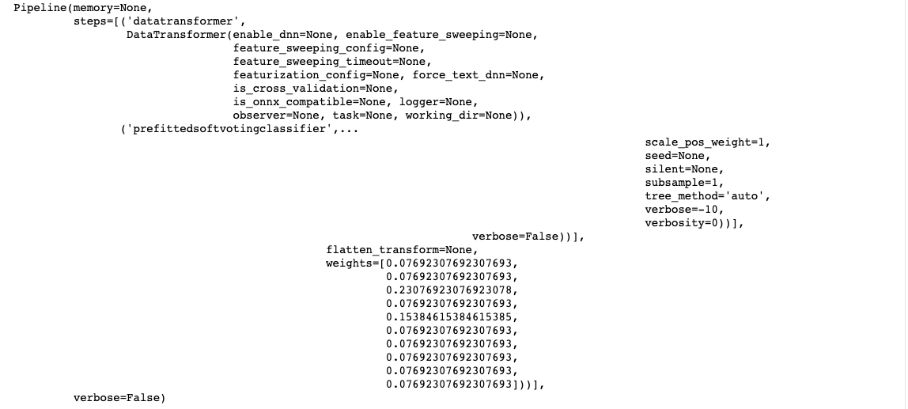

# Optimizing an ML Pipeline in Azure

## Overview
This project is part of the Udacity Azure ML Nanodegree. In this project, we build and optimize an Azure ML pipeline using the Python SDK and a provided Scikit-learn model. This model is then compared to an Azure AutoML run.

## Summary
#### Problem statement
This is a bank marketing dataset which has features containing some information about customer and about outcomes of previous contacts. Based on these features, it is determined whether the customer will subscribe to the product as a yes/no outcome.

#### Solution
Modeling using two methods - hyperdrive (parameter tuning) and AutoML was performed. The accuracy from the best model from hyperdrive was found to be 90.82% and that from the best model from AutoML was 92.13%.

## Scikit-learn Pipeline
#### Pipeline architecture, including data, hyperparameter tuning, and classification algorithm
The bank marketing dataset used for this project contains features like the age, job type, marital status, education, previous defaults, housing, loan information and information about the marketing call, with the outcome whether the customer subscribed to the bank product. The cleaning of the dataset including converting categorical features to numbers was part of the 'train.py' script.
A training script named 'train.py' also included:
* Obtaining the dataset
* A function to clean the dataset
* Split clean dataset into test and train (used for validating the model)
* Defining the Logistic Regression algorithm for classification
* Arguments that will be passed during hyperparameter tuning.
Using this training script, a hyperparameter job was defined, where in for each run, arguments will be passed through this training script which also included logging. A parameter sampler was defined to create the sampling space from which arguments where passed to the tuner.
The best model that was generated had an accuracy of 90.82% and the arguments that were passed to that model were 'C' value of 0.336 and 'max iterations' of 400.

#### Parameter Sampler
The parameter sampler that was chosen had a broad range of values, and the best model did not contain the boundary parameters. Because of this, it can be said that appropriate parameters where chosen. Once such values are obtained, finer search with smaller range around that parameters that were obtained in the best run. Such approach is helpful when initially there was not much information available on what range of parameters can be chosen. This method was chosen over Bayesian sampling as it generally needs more run time as the best practice to for number of runs in Bayesian sampling is to have greater than or equal to 20 times the number of hyperparameters.

#### Early Stopping Policy
The benefits of the chosen Bandit policy for early stopping primarily is that the runs are terminated when the primary metric (i.e. Accuracy in this case) is not within the slack value that was specified when compared to the best run. Such policy is really helpful when no information about the parameters is available initially and a set of parameters are required quickly in the exploratory phase. An early truncation policy may not be as good of policy in this case because it may remove some runs which might able to give us more information about the models. And similarly for median stopping policy it might cancel away some runs which might give more information about the problem itself.

## AutoML
Almost 100 runs were performed using AutoML module, where the best model was found to be a VotingEnsemble model. The ensembled algorithms were ['XGBoostClassifier', 'XGBoostClassifier', 'XGBoostClassifier', 'XGBoostClassifier', 'XGBoostClassifier', 'XGBoostClassifier', 'XGBoostClassifier', 'XGBoostClassifier', 'XGBoostClassifier', 'XGBoostClassifier'] with the ensemble weights of [0.07692307692307693, 0.07692307692307693, 0.23076923076923078, 0.07692307692307693, 0.15384615384615385, 0.07692307692307693, 0.07692307692307693, 0.07692307692307693, 0.07692307692307693, 0.07692307692307693]. The parameters generated by the AutoML run are shown below:

## Pipeline comparison
In the hyperdrive module, the classification algorithm was chosen before hand however in the AutoML module a bunch of classification algorithms were tested. In hyperdrive, there was room choosing the range of parameters for various runs, while AutoML intelligently chooses the parameters. The setup time was longer in the hyperdrive pipeline, while the setup of AutoML pipeline was fairly straightforward. Even with such differences, the accuracy of the best models for both pipelines were comparable. Hence, choosing the best path would depend on availability of resources and business accuracy requirement. The accuracy from the best model from hyperdrive was found to be 90.82% and that from the best model from AutoML was 92.13%.

## Future work
Few recommendations for this project:
* Creating a regression problem and addressing what changes in the architecture
* Using frameworks other than scikit-learn, like TensorFlow, PyTorch or self built algorithm can also bring changes in the project
* In this experiment 'Accuracy' was used as primary metric, other classification metrics like AUC, Precision, Recall can also used for model comparison
* Also, by not stopping the AutoML run early can bring in more possibilities of algorithms

## Proof of cluster clean up

# Reference
* DP100 Github repo - https://github.com/MicrosoftLearning/DP100
